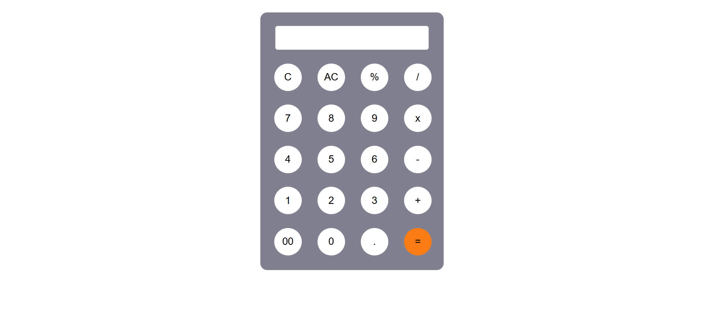

# Calculator Using JavaScript



Basic Calculator project using JavaScript

#### Technologies and Tools

- Html
- Css
- JavaScript
- Github Pages

## Installation and Setup Locally

To install and run this project Locally: 

* Download Zip file or Clone the repository
```shell
    git clone https://github.com/muhammedadil1024/calculatorproject.git
```
```shell
    cd calculatorproject
```
* Open project in any code editor.
* Open the Html page in any browser.

Thank You!
